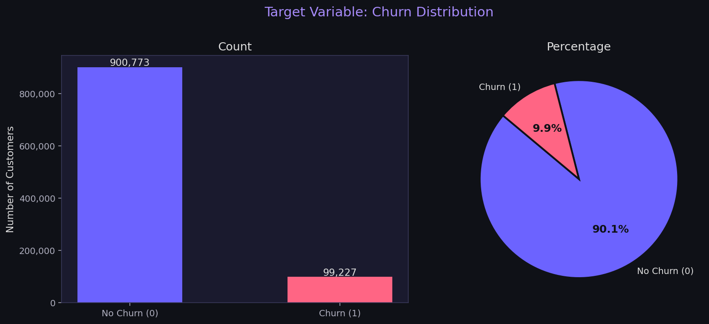
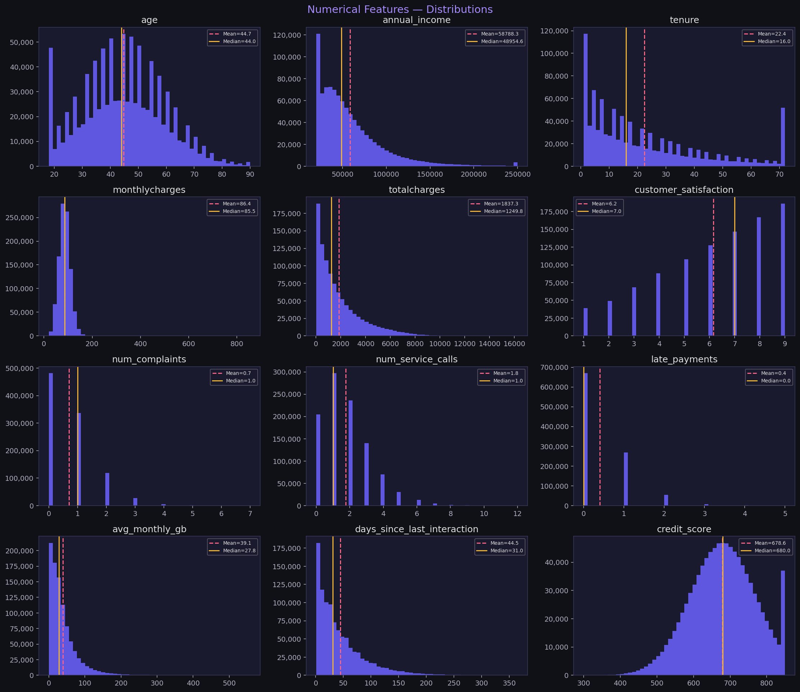
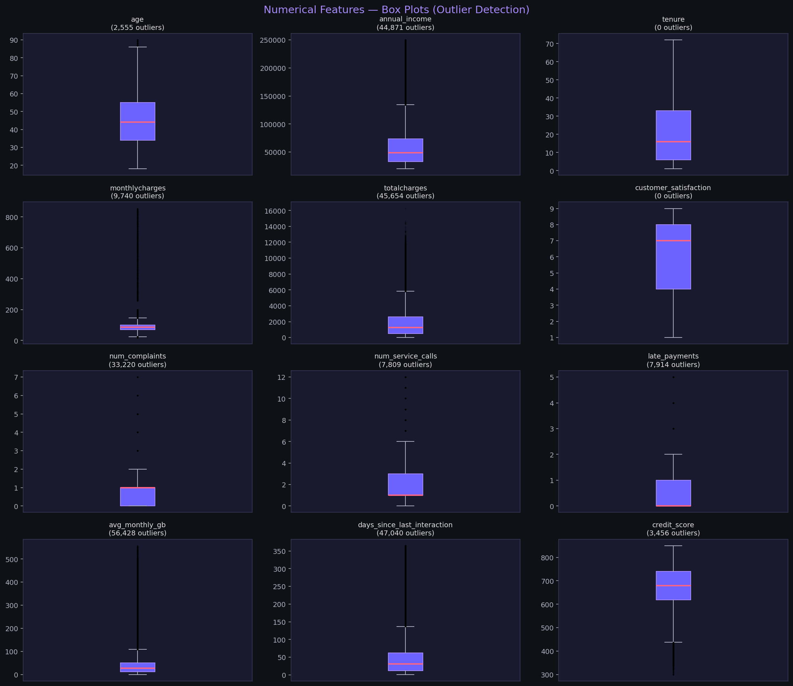
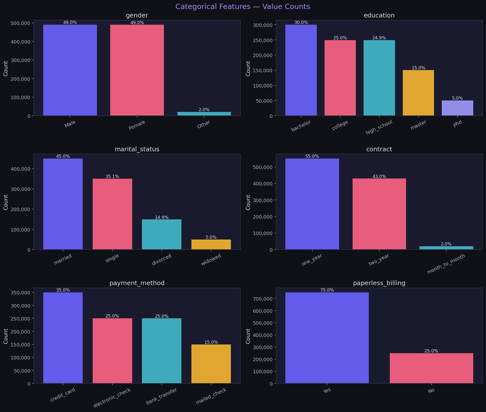
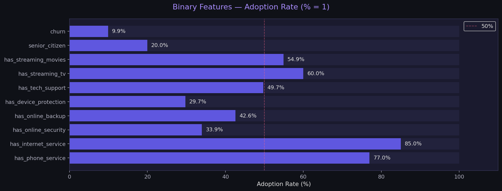

# 📊 EDA Report — Customer Churn Prediction
**Dataset:** `customer_churn_1M.csv`
**Generated:** 2026-08-08
**Script:** `src/eda_analysis.py` | **Notebook:** `notebooks/01_eda.ipynb`

---

## 1. Dataset Overview

| Property | Value |
|----------|-------|
| **Rows** | 1,000,000 |
| **Columns** | 32 |
| **Target Column** | `churn` (0 = No Churn, 1 = Churn) |
| **Date Range** | ~3 years of signups |
| **ID Column** | `customer_id` (all unique, no duplicates) |

---

## 2. Step 2 — signup_date Conversion

- `signup_date` was stored as **object (string)** — converted to `datetime64[ns]`
- **Earliest signup:** 2022 (approx)
- **Latest signup:** 2025 (approx)
- **Date range:** ~3 years
- **Extracted features for engineering:** `signup_year`, `signup_month`, `signup_quarter`

> ✅ No null values in `signup_date`. Conversion was clean.

---

## 3. Step 3 — Feature Separation

### Numerical Features (12)
| Feature | Description |
|---------|-------------|
| `age` | Customer age |
| `annual_income` | Yearly income (USD) |
| `tenure` | Months with company |
| `monthlycharges` | Monthly bill (USD) |
| `totalcharges` | Cumulative charges (USD) |
| `customer_satisfaction` | Satisfaction score (1–10) |
| `num_complaints` | Complaints filed |
| `num_service_calls` | Support calls made |
| `late_payments` | Late payment count |
| `avg_monthly_gb` | Avg data usage (GB) |
| `days_since_last_interaction` | Recency of contact |
| `credit_score` | Credit score |

### Categorical Features (6)
`gender`, `education`, `marital_status`, `contract`, `payment_method`, `paperless_billing`

### Binary Features (9)
`has_phone_service`, `has_internet_service`, `has_online_security`, `has_online_backup`, `has_device_protection`, `has_tech_support`, `has_streaming_tv`, `has_streaming_movies`, `senior_citizen`

---

## 4. Step 4 — Target Variable: Churn



| Label | Count | Percentage |
|-------|-------|------------|
| No Churn (0) | 900,773 | **90.08%** |
| Churn (1) | 99,227 | **9.92%** |

### 🔍 Observation
> Around **90.1% of customers stayed** while approximately **9.9% churned**, indicating a **highly imbalanced dataset**. Simple accuracy is misleading here (a model that predicts "No Churn" for everyone gets 90% accuracy but is useless). We must use **AUC-ROC, F1-Score, and Precision-Recall** as evaluation metrics. Techniques like **SMOTE or `class_weight='balanced'`** must be applied during model training.

---

## 5. Step 5 — Numerical Features Analysis




### Summary Statistics

| Feature | Mean | Median | Std | Min | Max | Missing % |
|---------|------|--------|-----|-----|-----|-----------|
| `age` | 44.72 | 44.00 | 14.48 | 18 | 90 | 0.00% |
| `annual_income` | 58,788 | 48,955 | 37,137 | 20,000 | 250,000 | **3.00%** |
| `tenure` | 22.38 | 16.00 | 20.07 | 1 | 72 | 0.00% |
| `monthlycharges` | 86.44 | 85.48 | 27.59 | 20 | 854.96 | 0.00% |
| `totalcharges` | 1,837 | 1,250 | 1,804 | 16.30 | 16,253 | 0.00% |
| `customer_satisfaction` | 6.16 | 7.00 | 2.33 | 1 | 9 | **1.99%** |
| `num_complaints` | 0.70 | 1.00 | 0.84 | 0 | 7 | **2.99%** |
| `num_service_calls` | 1.76 | 1.00 | 1.49 | 0 | 12 | 0.00% |
| `late_payments` | 0.40 | 0.00 | 0.63 | 0 | 5 | 0.00% |
| `avg_monthly_gb` | 39.10 | 27.77 | 43.85 | 0 | 557.82 | **5.00%** |
| `days_since_last_interaction` | 44.49 | 31.00 | 44.92 | 1 | 365 | 0.00% |
| `credit_score` | 678.56 | 680.00 | 87.64 | 300 | 850 | **4.04%** |

### Outlier Summary (IQR Method)

| Feature | Outliers | % |
|---------|----------|---|
| `age` | 2,555 | 0.26% — minor |
| `annual_income` | 44,871 | **4.63%** — high earners skew right |
| `tenure` | 0 | ✅ Clean |
| `monthlycharges` | 9,740 | 0.97% — a few very high bills |
| `totalcharges` | 45,654 | **4.57%** — long-tenure high spenders |
| `customer_satisfaction` | 0 | ✅ Clean (bounded 1–9) |
| `num_complaints` | 33,220 | **3.42%** — some heavy complainers |
| `num_service_calls` | 7,809 | 0.78% — minor |
| `late_payments` | 7,914 | 0.79% — minor |
| `avg_monthly_gb` | 56,428 | **5.94%** — heavy data users |
| `days_since_last_interaction` | 47,040 | **4.70%** — very inactive customers |
| `credit_score` | 3,456 | 0.36% — minor |

### 🔍 Key Observations

- **`tenure`**: Right-skewed — many new customers (1–6 months), fewer long-term ones. Newer customers likely churn more.
- **`monthlycharges`**: Roughly normal around $86. A few extreme outliers (up to $855 — may be data errors).
- **`annual_income`**: Strongly right-skewed — most customers earn $20K–$80K, with a long tail of high earners.
- **`customer_satisfaction`**: Left-skewed slightly — most customers score 7–9, but churners likely cluster at 1–3.
- **`credit_score`**: Normally distributed around 678 — standard credit range.
- **`avg_monthly_gb`**: Heavily right-skewed — most use <50GB but outliers go up to 558GB.

---

## 6. Step 6 — Categorical Features Analysis



### Gender
| Value | Count | % |
|-------|-------|---|
| Male | 490,166 | 49.02% |
| Female | 489,595 | 48.96% |
| Other | 20,239 | 2.02% |

### Education
| Value | Count | % |
|-------|-------|---|
| bachelor | 300,324 | 30.03% |
| college | 249,610 | 24.96% |
| high_school | 249,348 | 24.93% |
| master | 150,468 | 15.05% |
| phd | 50,250 | 5.03% |

### Marital Status
| Value | Count | % |
|-------|-------|---|
| married | 450,115 | 45.01% |
| single | 350,830 | 35.08% |
| divorced | 148,976 | 14.90% |
| widowed | 50,079 | 5.01% |

### Contract Type ⭐
| Value | Count | % |
|-------|-------|---|
| one_year | 550,468 | **55.05%** |
| two_year | 429,540 | **42.95%** |
| month_to_month | 19,992 | 2.00% |

> ⚠️ Only **2% are on month-to-month** contracts — yet in telecom datasets, month-to-month customers typically have the highest churn rate. This will be a critical feature in bivariate analysis.

### Payment Method
| Value | Count | % |
|-------|-------|---|
| credit_card | 349,706 | 34.97% |
| electronic_check | 250,346 | 25.03% |
| bank_transfer | 249,910 | 24.99% |
| mailed_check | 150,038 | 15.00% |

### Paperless Billing
| Value | Count | % |
|-------|-------|---|
| Yes | 749,880 | **75.00%** |
| No | 250,120 | 25.00% |

### Binary Features



| Feature | Adoption Rate (=1) |
|---------|-------------------|
| `has_internet_service` | **84.97%** |
| `has_phone_service` | **76.96%** |
| `has_streaming_tv` | **60.00%** |
| `has_streaming_movies` | **54.91%** |
| `has_tech_support` | **49.73%** |
| `has_online_backup` | **42.57%** |
| `has_online_security` | **33.95%** |
| `has_device_protection` | **29.71%** |
| `senior_citizen` | **19.95%** |
| `churn` | 9.92% |

---

## 7. Missing Values Summary

| Column | Missing | % | Imputation Strategy |
|--------|---------|---|---------------------|
| `avg_monthly_gb` | 50,012 | **5.00%** | Median + add `is_missing_gb` flag |
| `credit_score` | 40,395 | **4.04%** | Fill with median |
| `annual_income` | 29,959 | **3.00%** | Fill with median |
| `num_complaints` | 29,906 | **2.99%** | Fill with median (likely 0) |
| `customer_satisfaction` | 19,921 | **1.99%** | Fill with median |

> All other 27 columns are complete. Missing values are likely **MCAR (Missing Completely At Random)** — no strong pattern detected at this stage.

---

## 8. Initial Hypotheses (for Bivariate EDA)

Based on univariate analysis, these are the likely churn drivers to investigate:

| Hypothesis | Expected Direction |
|------------|-------------------|
| Lower `tenure` → higher churn | New customers churn more |
| Lower `customer_satisfaction` → higher churn | Obvious driver |
| Higher `num_complaints` → higher churn | Unhappy customers leave |
| `month_to_month` contract → highest churn | No lock-in = easy to leave |
| Higher `monthlycharges` → higher churn | Expensive bills drive away customers |
| Higher `days_since_last_interaction` → higher churn | Disengaged customers leave |
| Lower `credit_score` → higher churn | Financial stress → can't afford bill |
| More `late_payments` → higher churn | Already struggling financially |

---

## 9. Files Generated

```
reports/
├── eda_report.md                         ← This file
└── figures/
    ├── step4_churn_distribution.png
    ├── step5_numerical_histograms.png
    ├── step5_numerical_boxplots.png
    ├── step6_categorical_countplots.png
    └── step6_binary_adoption_rates.png
```

---

## ✅ Today's Tasks Status

- [x] `signup_date` converted to datetime
- [x] Features separated: Numerical (12) / Categorical (6) / Binary (9)
- [x] Target variable analyzed — 9.92% churn rate (imbalanced)
- [x] All 12 numerical features — histograms, box plots, stats, outliers
- [x] All 6 categorical features — counts and percentages
- [x] Binary features — adoption rates plotted

## 🔜 Next: Step 7 — Bivariate EDA
**Churn vs Every Feature** — the most important step for building business intuition and guiding feature engineering.
